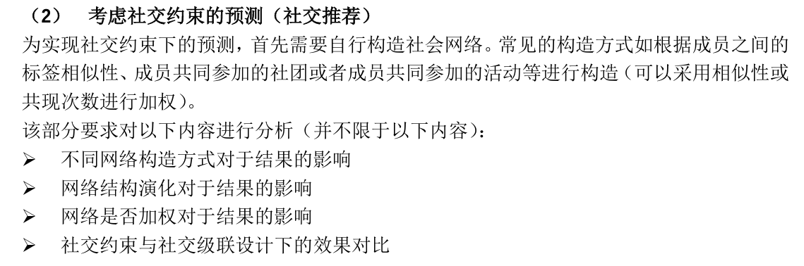

# social-computing-experiment
This project was built to record the experiment implementation source code of my social computing course taught by Professor Tong Xu.

## Table of Contents
- [Built With](#built-with)
- [Maintainers](#maintainers)

## Built With
* [Google Colab](https://research.google.com/colaboratory/) - Colab is basically a free Jupyter notebook environment running wholly in the cloud.

## Maintainers
[@DixinFan](https://github.com/DixinFan). 
Something not working as expected? Feel free to open an issue.

